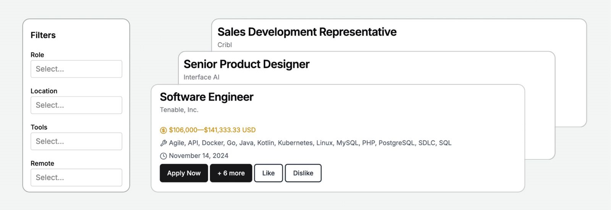

# Careerhound — Next-Gen Job Discovery Engine 🚀

A modern, high-speed job discovery platform designed to surface **verified, direct-source tech jobs** directly from employer ATS platforms (Greenhouse, Lever, Ashby, SmartRecruiters) and open feeds, bypassing saturated third-party portals.



## Features

- **Direct ATS Integration**: Ingests real-time job listings from verified company subdomains (Stripe, Datadog, Linear, Figma, Notion, Cursor, Ramp, Lyft, etc.).
- **Interactive 3D Globe Radar (`/radar`)**: Explore verified direct-source tech jobs globally using an interactive Three.js 3D Globe with fly-to zoom across global tech hubs (Bangalore, San Francisco, New York, London, Berlin, Singapore).
- **100% Transparency**: Unblurred employer names, verified salary disclosures, and direct-to-ATS application links (`Apply Direct`).
- **Filter by Role & Mode**: Search across Software Engineering, Cloud/DevOps, AI/ML, Design, and 100% Remote vs. Hybrid/On-site opportunities.

## Tech Stack

- **Framework**: [Next.js 14](https://nextjs.org/) (App Router, Static Generation)
- **Styling**: [Tailwind CSS](https://tailwindcss.com/)
- **3D Visualization**: [Three.js](https://threejs.org/)
- **Icons**: [Lucide React](https://lucide.dev/)
- **Data Engine**: Direct ATS Ingestion Pipeline (`scripts/ingest-real-data.mjs`)

## Getting Started

### 1. Install Dependencies
```bash
npm install
```

### 2. Run the Development Server
```bash
npm run dev
```

Open [http://localhost:3000](http://localhost:3000) in your browser.

- **Main Job Search**: [http://localhost:3000/job-search/all](http://localhost:3000/job-search/all)
- **3D Globe Radar**: [http://localhost:3000/radar](http://localhost:3000/radar)

### 3. Ingest Fresh Live Jobs
To run the automated ATS scraper and update live jobs:
```bash
node scripts/ingest-real-data.mjs
```

### 4. Build for Production
```bash
npm run build
npm run start
```
