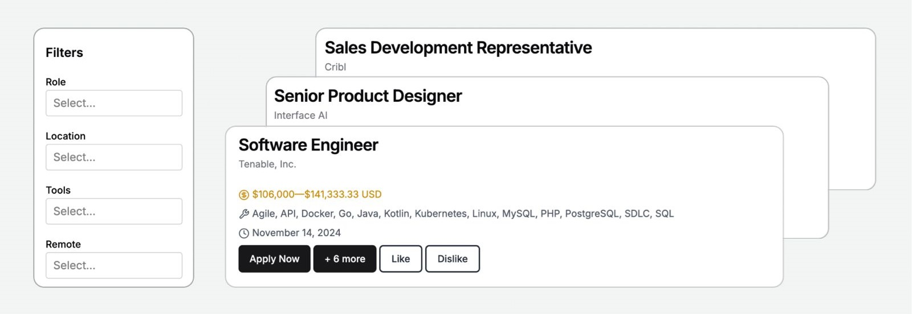

# Careerhound — Next-Gen Job Discovery Engine 🚀

A modern, high-speed job discovery platform designed to surface **verified, direct-source tech jobs** directly from employer ATS platforms (Greenhouse, Lever, Ashby, SmartRecruiters) and open feeds, bypassing saturated third-party portals.



## Features

- **Direct ATS Integration**: Ingests real-time job listings from verified company subdomains (Stripe, Datadog, Linear, Figma, Notion, Cursor, Ramp, Lyft, etc.).
- **Interactive 3D Globe Radar (`/radar`)**: Explore verified direct-source tech jobs globally using an interactive Three.js 3D Globe with fly-to zoom across global tech hubs (Bangalore, San Francisco, New York, London, Berlin, Singapore).
- **100% Transparency**: Unblurred employer names, verified salary disclosures, and direct-to-ATS application links (`Apply Direct`).
- **Filter by Role & Mode**: Search across Software Engineering, Cloud/DevOps, AI/ML, Design, and 100% Remote vs. Hybrid/On-site opportunities.

## Tech Stack

- **Framework**: [Next.js 14](https://nextjs.org/) (App Router, Static Generation)
- **Styling**: [Tailwind CSS](https://tailwindcss.com/)
- **3D Visualization**: [Three.js](https://threejs.org/)
- **Icons**: [Lucide React](https://lucide.dev/)
- **Data Engine**: Direct ATS Ingestion Pipeline (`scripts/ingest-real-data.mjs`)

## Getting Started

### 1. Install Dependencies
```bash
npm install
```

### 2. Run the Development Server
```bash
npm run dev
```

Open [http://localhost:3000](http://localhost:3000) in your browser.

- **Main Job Search**: [http://localhost:3000/job-search/all](http://localhost:3000/job-search/all)
- **3D Globe Radar**: [http://localhost:3000/radar](http://localhost:3000/radar)

### 3. Automated Job Ingestion & Cleanup Pipeline

CareerMonke includes a fully automated daily pipeline to fetch tech jobs from public ATS endpoints (Greenhouse, Lever, Ashby) and free APIs/RSS feeds (Remotive, RemoteOK, Arbeitnow, We Work Remotely), normalize them, and upsert them with deduplication directly into Supabase.

#### A. Database Migration
Before running live ingestion, execute the schema migration in your Supabase SQL Editor:
```bash
# File location:
supabase/migrations/20261001_ingestion_pipeline.sql
```

#### B. Run Ingestion Locally
```bash
# Dry run (fetches, parses, and prints summary table without writing to Supabase)
npm run ingest:dry

# Dry run with sample limit per source
npx tsx scripts/ingest.ts --dry --per-source 20

# Run on a specific source only
npx tsx scripts/ingest.ts --dry --source ashby-openai

# Live production run (upserts into Supabase and runs cleanup)
npm run ingest

# Run cleanup/expiration only
npx tsx scripts/ingest.ts --cleanup-only
```

#### C. How to Add a New Source
Add an entry to `scripts/config/sources.json` without modifying any code:
```json
// For Greenhouse company
{ "id": "greenhouse-datadog", "name": "Datadog", "type": "greenhouse", "target": "datadog", "enabled": true }

// For Ashby company
{ "id": "ashby-cursor", "name": "Cursor", "type": "ashby", "target": "cursor", "enabled": true }

// For Lever company
{ "id": "lever-canva", "name": "Canva", "type": "lever", "target": "canva", "enabled": true }

// For custom RSS or API feed
{ "id": "rss-myfeed", "name": "Custom Feed", "type": "weworkremotely", "target": "https://example.com/jobs.rss", "enabled": true }
```

#### D. Scheduled Daily Automation (GitHub Actions)
- The workflow at `.github/workflows/ingest.yml` automatically triggers daily at **02:00 AM IST (20:30 UTC)**.
- It can also be manually dispatched from the **Actions** tab with custom dry-run and cap flags.
- **Required GitHub Secrets**:
  - `NEXT_PUBLIC_SUPABASE_URL`
  - `SUPABASE_SERVICE_ROLE_KEY`

### 4. Build for Production
```bash
npm run build
npm run start
```
